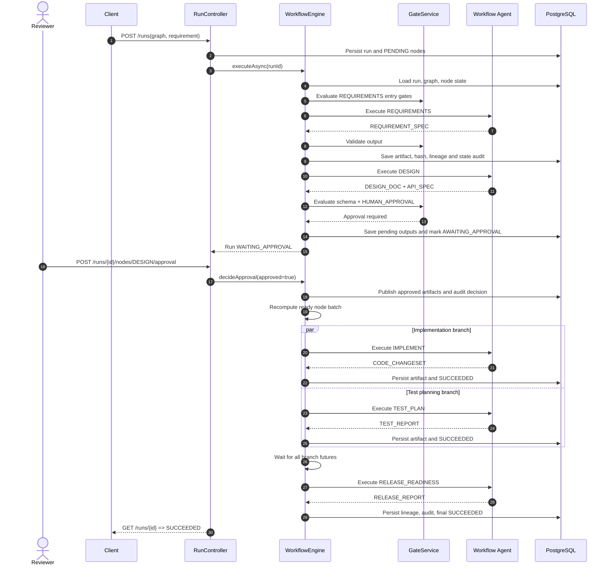
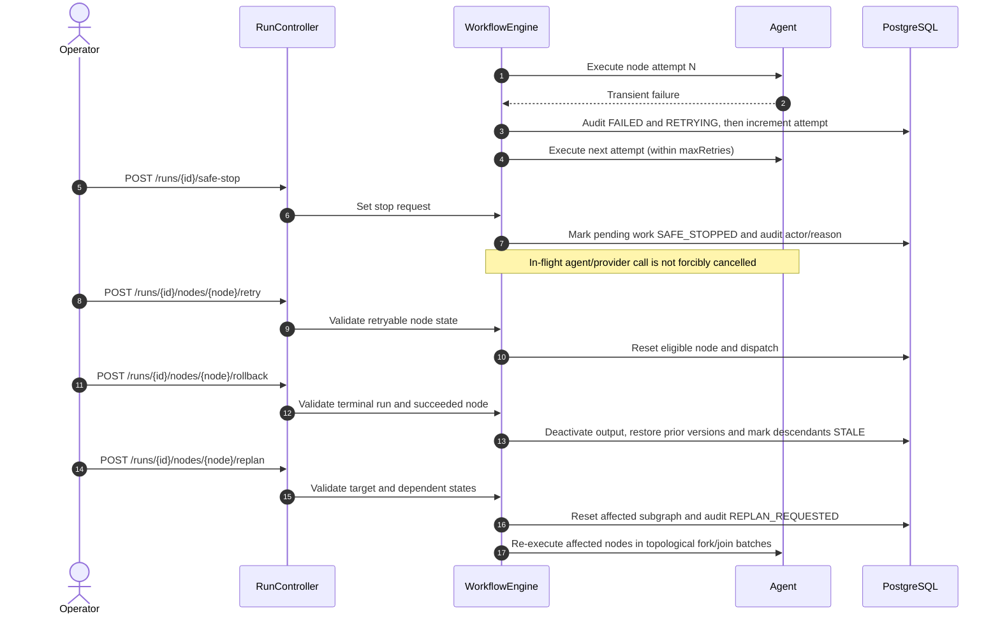
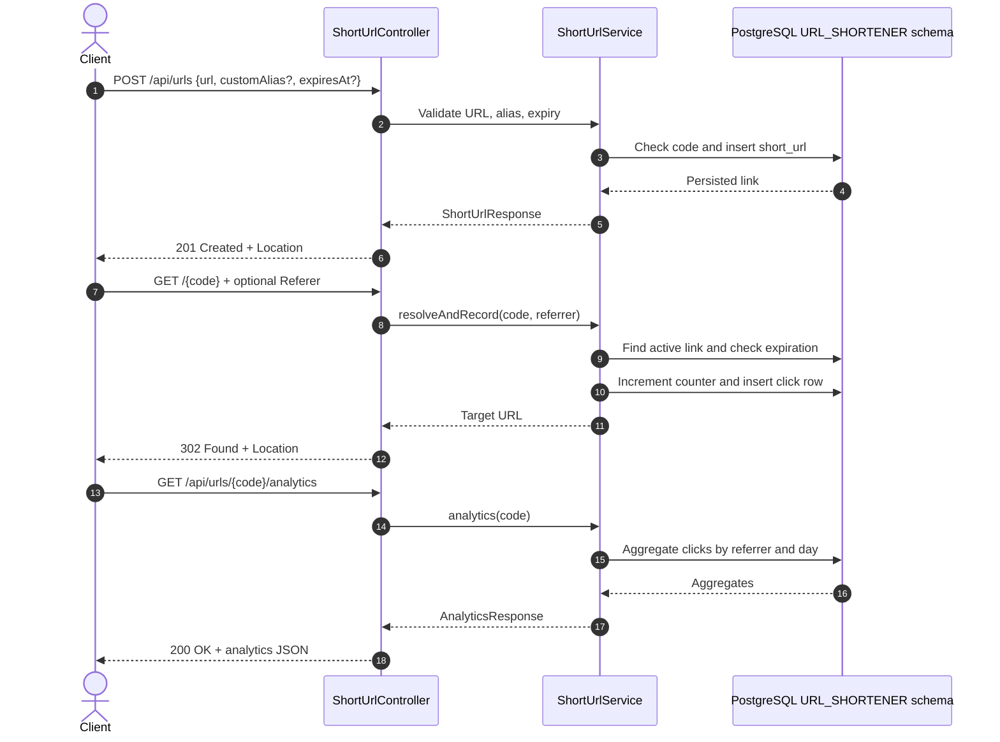

# Sequence Diagrams

## Governed run: approval, fork, and join

```mermaid
sequenceDiagram
    autonumber
    actor Reviewer
    participant Client
    participant API as RunController
    participant Engine as WorkflowEngine
    participant Gates as GateService
    participant Agent as Workflow Agent
    participant DB as PostgreSQL
    Client->>API: POST /runs(graph, requirement)
    API->>DB: Persist run and PENDING nodes
    API->>Engine: executeAsync(runId)
    Engine->>DB: Load run, graph, node state
    Engine->>Gates: Evaluate REQUIREMENTS entry gates
    Engine->>Agent: Execute REQUIREMENTS
    Agent-->>Engine: REQUIREMENT_SPEC
    Engine->>Gates: Validate output
    Engine->>DB: Save artifact, hash, lineage and state audit
    Engine->>Agent: Execute DESIGN
    Agent-->>Engine: DESIGN_DOC + API_SPEC
    Engine->>Gates: Evaluate schema + HUMAN_APPROVAL
    Gates-->>Engine: Approval required
    Engine->>DB: Save pending outputs and mark AWAITING_APPROVAL
    Engine-->>API: Run WAITING_APPROVAL
    Reviewer->>API: POST /runs/{id}/nodes/DESIGN/approval
    API->>Engine: decideApproval(approved=true)
    Engine->>DB: Publish approved artifacts and audit decision
    Engine->>Engine: Recompute ready node batch
    par Implementation branch
        Engine->>Agent: Execute IMPLEMENT
        Agent-->>Engine: CODE_CHANGESET
        Engine->>DB: Persist artifact and SUCCEEDED
    and Test planning branch
        Engine->>Agent: Execute TEST_PLAN
        Agent-->>Engine: TEST_REPORT
        Engine->>DB: Persist artifact and SUCCEEDED
    end
    Engine->>Engine: Wait for all branch futures
    Engine->>Agent: Execute RELEASE_READINESS
    Agent-->>Engine: RELEASE_REPORT
    Engine->>DB: Persist lineage, audit, final SUCCEEDED
    API-->>Client: GET /runs/{id} => SUCCEEDED
```

## Retry, safe-stop, rollback, and replan controls

```mermaid
sequenceDiagram
    autonumber
    actor Operator
    participant API as RunController
    participant Engine as WorkflowEngine
    participant Agent as Agent
    participant DB as PostgreSQL
    Engine->>Agent: Execute node attempt N
    Agent-->>Engine: Transient failure
    Engine->>DB: Audit FAILED and RETRYING, then increment attempt
    Engine->>Agent: Execute next attempt (within maxRetries)
    Operator->>API: POST /runs/{id}/safe-stop
    API->>Engine: Set stop request
    Engine->>DB: Mark pending work SAFE_STOPPED and audit actor/reason
    Note over Engine,Agent: In-flight agent/provider call is not forcibly cancelled
    Operator->>API: POST /runs/{id}/nodes/{node}/retry
    API->>Engine: Validate retryable node state
    Engine->>DB: Reset eligible node and dispatch
    Operator->>API: POST /runs/{id}/nodes/{node}/rollback
    API->>Engine: Validate terminal run and succeeded node
    Engine->>DB: Deactivate output, restore prior versions and mark descendants STALE
    Operator->>API: POST /runs/{id}/nodes/{node}/replan
    API->>Engine: Validate target and dependent states
    Engine->>DB: Reset affected subgraph and audit REPLAN_REQUESTED
    Engine->>Agent: Re-execute affected nodes in topological fork/join batches
```

## URL shortener create, redirect, and analytics

```mermaid
sequenceDiagram
    autonumber
    actor Client
    participant API as ShortUrlController
    participant Service as ShortUrlService
    participant DB as PostgreSQL URL_SHORTENER schema
    Client->>API: POST /api/urls {url, customAlias?, expiresAt?}
    API->>Service: Validate URL, alias, expiry
    Service->>DB: Check code and insert short_url
    DB-->>Service: Persisted link
    Service-->>API: ShortUrlResponse
    API-->>Client: 201 Created + Location
    Client->>API: GET /{code} + optional Referer
    API->>Service: resolveAndRecord(code, referrer)
    Service->>DB: Find active link and check expiration
    Service->>DB: Increment counter and insert click row
    Service-->>API: Target URL
    API-->>Client: 302 Found + Location
    Client->>API: GET /api/urls/{code}/analytics
    API->>Service: analytics(code)
    Service->>DB: Aggregate clicks by referrer and day
    DB-->>Service: Aggregates
    Service-->>API: AnalyticsResponse
    API-->>Client: 200 OK + analytics JSON
```
